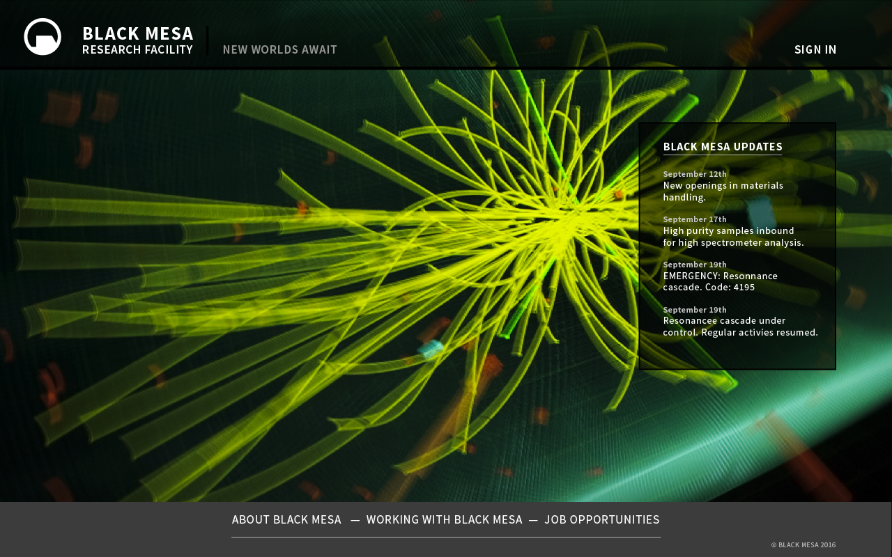
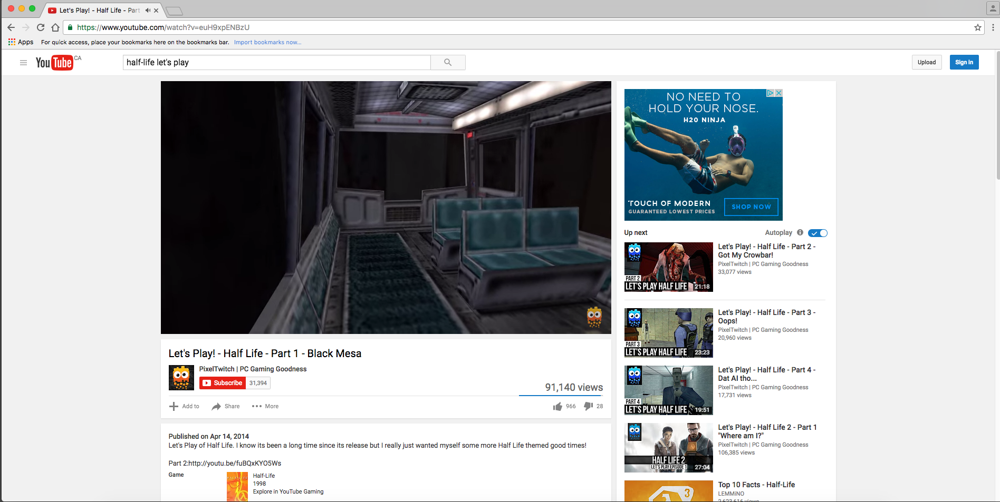
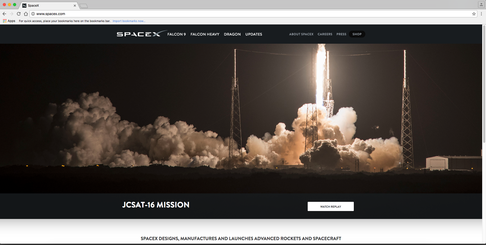
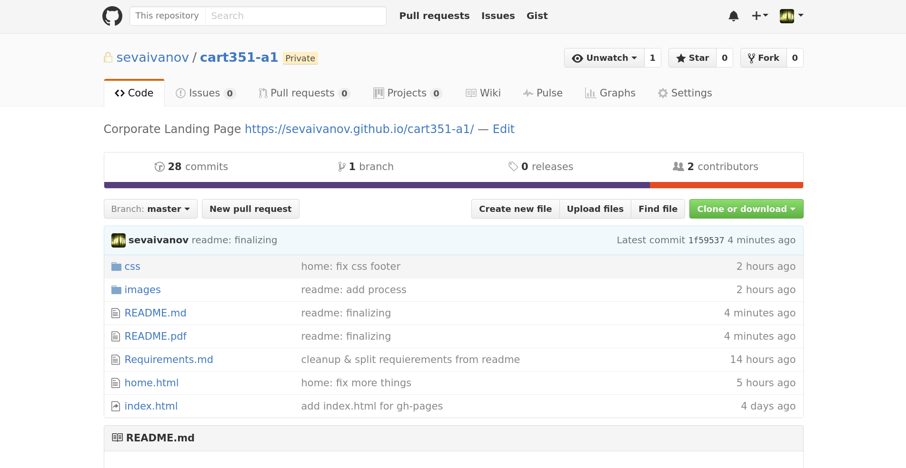
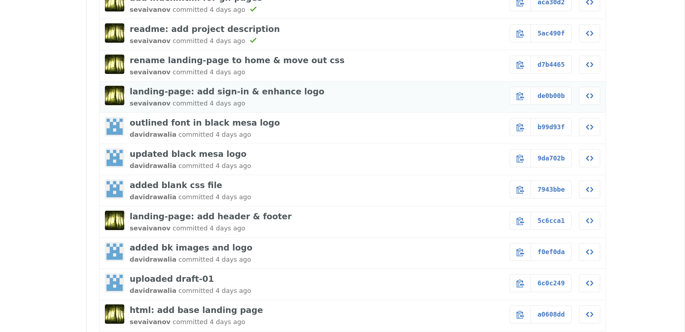

# Corporate Landing Page

*Created by Seva Ivanov and David Rawlia for CART 351 in autmumn of 2016.*

Originally written on GitHub which can be previewed at [here](https://sevaivanov.github.io/cart351-a1/) and it will be available on [tumahn.net/cart/351/corporate-landing-page/](https://tumahn.net/cart/351/corporate-landing-page/) soon.

The purpose is to explore the mystic company of the video game Half-Life called Black Mesa.

> Black Mesa undertakes research in various fields from standard scientific research to radiation, rocketry, theoretical physics, lasers, experimental propulsion, hydraulics, robotics, hydroelectricity, genetics, zoology, applied mathematics, and a very wide spectrum of research into chemistry and all manner of physics research. The research is mostly conducted in the Black Mesa Research Facility and includes both pure research and applied science. - [Half-Life wiki](http://half-life.wikia.com/wiki/Black_Mesa) 

To stay true to the aestetics of this company in the context of the video game, we decided to implement glitches.

These glitches recreate the atmosphere of Black Mesa which is conducting some suspicious activities, namely opening a portal to other worlds. The latter recreates an invasion from outer world ambience. Moreover, they are a subtile sign of the correlated scientifics in the video game trying to inform the public of the real experiments held in their underground facilities.

## Glitches

**Prea -> Caesar cipher -> Cern**

Hover your mouse over it and see the beautiful tentacles artwork taken from [enpleinair.org](http://enpleinair.org/).

**Gman**

Resize your browser to a certain width and he will be waiting for you.

\pagebreak

## Design

Here is how our first design idea looked like :

Since there was tons of features to implement, we decided to focus on the quality and responsivenss rather than the quantity of visual element on the landing page.

\pagebreak

## Process

We started by exploring the gender by watching the video of the game.

Then, we searched some inspiration from existing compagnies like SpaceX :

\pagebreak

Finally, we decided to push it further by collaborating using the Git revision system on Github :

